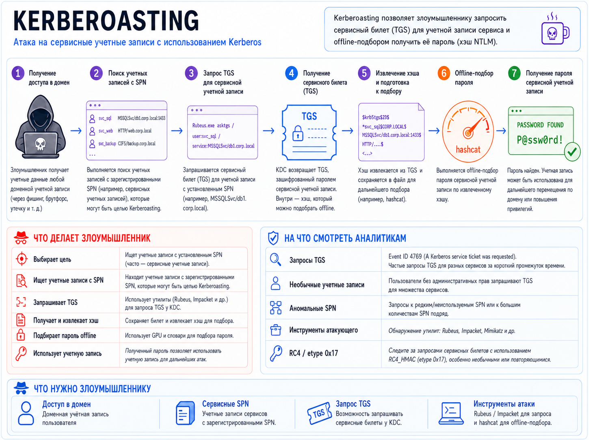

# Kerberoasting

> **Kerberoasting** - это атака на Kerberos в Active Directory, при которой злоумышленник получает TGS-билет для учётной записи с SPN и затем офлайн подбирает пароль по зашифрованной части билета.

---

## Основные типы Kerberoasting

### 1. Классический Kerberoasting

Классический Kerberoasting - запрашиваются TGS для существующих SPN, после чего выполняется офлайн-подбор пароля сервисной учётной записи.

### 2. Targeted Kerberoasting

Targeted Kerberoasting - атакующий выбирает конкретные аккаунты: например, сервисные учётки с высокими привилегиями или слабой парольной политикой.

### 3. RC4 Kerberoasting / Encryption downgrade

RC4 Kerberoasting / Encryption downgrade - попытка получить билет с шифрованием `RC4-HMAC = etype 23 = 0x17`, поскольку такие хэши обычно существенно удобнее для перебора, чем современные AES-варианты.

### 4. AES Kerberoasting

AES Kerberoasting - работа с TGS, зашифрованными `AES128/AES256 (etype 17/18)`. Принцип тот же, но офлайн-подбор обычно вычислительно дороже.

### 5. Kerberoasting через созданный/добавленный SPN

Kerberoasting через созданный/добавленный SPN - необходимо право, позволяющее изменять `servicePrincipalName` объекта. Например, `GenericAll`, `GenericWrite`, соответствующий `WriteProperty` или подходящее `validated write` право на SPN. Эту разновидность часто называют `targeted Kerberoasting via SPN manipulation`.

### 6. Kerberoasting без специализированных offensive-инструментов

Kerberoasting без специализированных offensive-инструментов - технически это та же атака, но запросы Kerberos формируются напрямую через протокол, что может менять телеметрию и способы обнаружения.

---



---

## Этапы атаки

### 1. Получение доступа в домен

Злоумышленник получает учётные данные любой доменной учётной записи (через фишинг, брутфорс, утечку и т.д.) и аутентифицируется.

### 2. Поиск учётных записей, обладающих SPN

Выполняется поиск учётных записей с зарегистрированными SPN.

Например, при помощи LDAP с использованием запроса:

```text
(&(objectClass=user)(objectCategory=user)(servicePrincipalName=*))
```

Также есть `PowerView`, `GetUserSPNs.py` из `impacket`.

### 3. Запрос и получение TGS для учётной записи с установленным SPN

Можно использовать `Rubeus`, `Impacket GetUserSPNs.py`, `Invoke-Kerberoast`

### 4. Извлечение хэша TGS и оффлайн подбор

Хэш извлекается из TGS и сохраняется в файл для offline-подбора пароля. Можно использовать `hashcat`, `John the Ripper`. После получения пароля, учётная запись может быть использована для дальнейшего перемещения по домену или повышения привилегий.

---

## Причины, по которым Kerberoasting вообще возможен

### 1. При запросе TGS, контроллер домена (DC) не занимается авторизацией

То есть DC не проверяет, есть ли у пользователя, который запрашивает TGS, права на доступ к этому сервису. Поэтому можно запросить TGS ко всем SPN в домене.

### 2. TGS шифруются с использованием секрета сервисной учётной записи

Это позволяет восстановить пароль сервисной учётной записи при условии, что пароль недостаточно стойкий.

> Злоумышленников интересуют SPN, ассоциирующиеся с учётными записями пользователей, а не компьютеров, так как компьютерные УЗ (как правило) имеют очень стойкий пароль, сгенерированные не вручную

---

## На что смотреть?

### 1. Аномальное количество запросов TGS на DC

`Event ID = 4769`

Чаще всего в связке с:

```text
Ticket Encryption Type = 0x17 (RC4-HMAC)
```

### 2. Большое количество уникальных SPN за короткий промежуток времени

### 3. Запросы TGS к нетипичным или редко используемым SPN

### 4. Аномальный источник запросов

Запросы TGS с пользовательского хоста могут вызвать больше подозрений, чем запросы с сервера

---

## Способы митигации:

### 1. Перевод сервисов на gMSA

Перевод сервисов на `gMSA (Group Managed Service Accounts)` там, где это возможно. У gMSA длинные случайные пароли, которыми управляет AD и которые автоматически меняются.

### 2. Длинные случайные пароли

Для обычных сервисных учётных записей использовать очень длинные случайные пароли с высокой энтропией, желательно `25-30+` символов.

### 3. Убирать RC4 и использовать AES

По возможности отключать RC4 для Kerberos и поддерживать:

* `AES128 - 0x11`
* `AES256 - 0x12`

> При этом важно учитывать, что AES не устраняет Kerberoasting полностью. TGS всё равно можно получить и пытаться подобрать пароль offline, просто это значительно менее выгодно злоумышленнику.

### 4. Минимизировать привилегии сервисных учётных записей

Сервисная учётная запись не должна быть:

* `Domain Admin`;
* `Enterprise Admin`;
* локальным администратором на нескольких серверов без необходимости;
* членом других высокопривилегированных групп.

> В идеале компрометация одной такой учётки должна давать доступ только к конкретному сервису.

### 5. SPN honeypot

SPN honeypot - один из эффективных способов детектирования Kerberoasting, заключающийся в создании подложных учётных записей, обладающих SPN, которые не используются.

> В обычной жизни клиенты Kerberos не будут запрашивать TGS для подложной SPN. Поэтому, если в журнале Security на DC появится событие 4769 для этой учётной записи - то это должно наводить на соответсвующие мысли.
