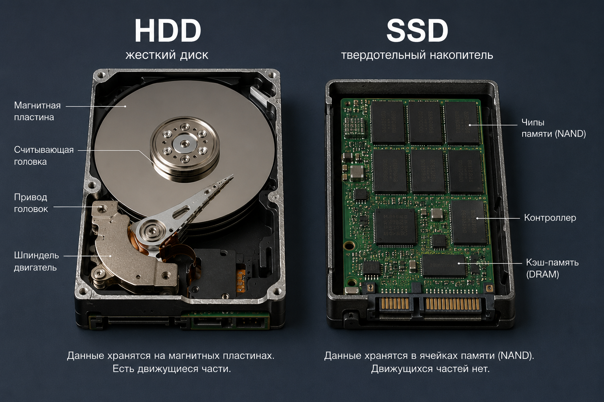
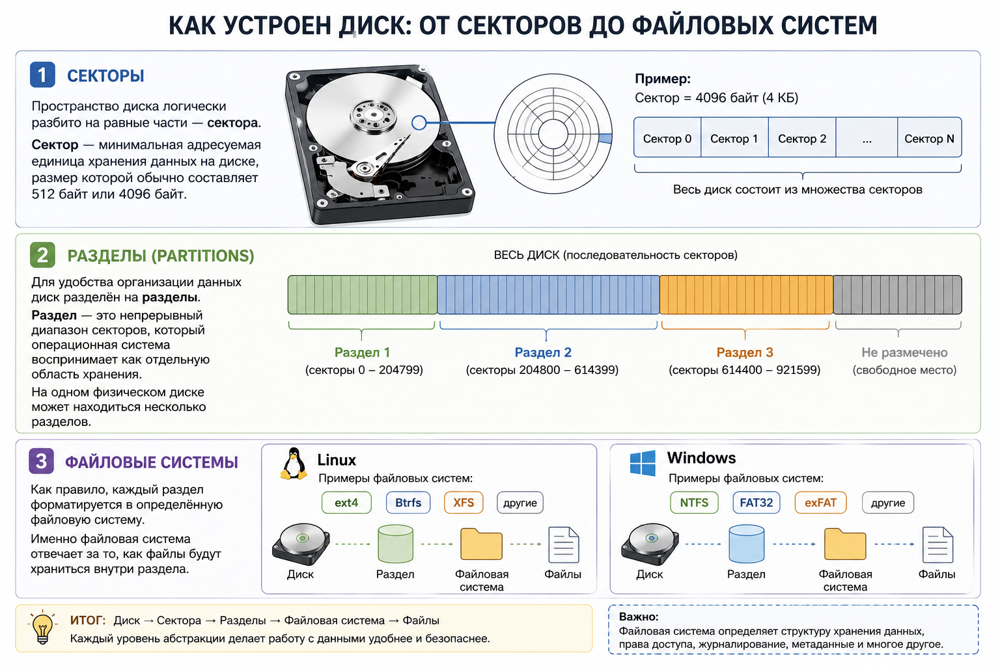
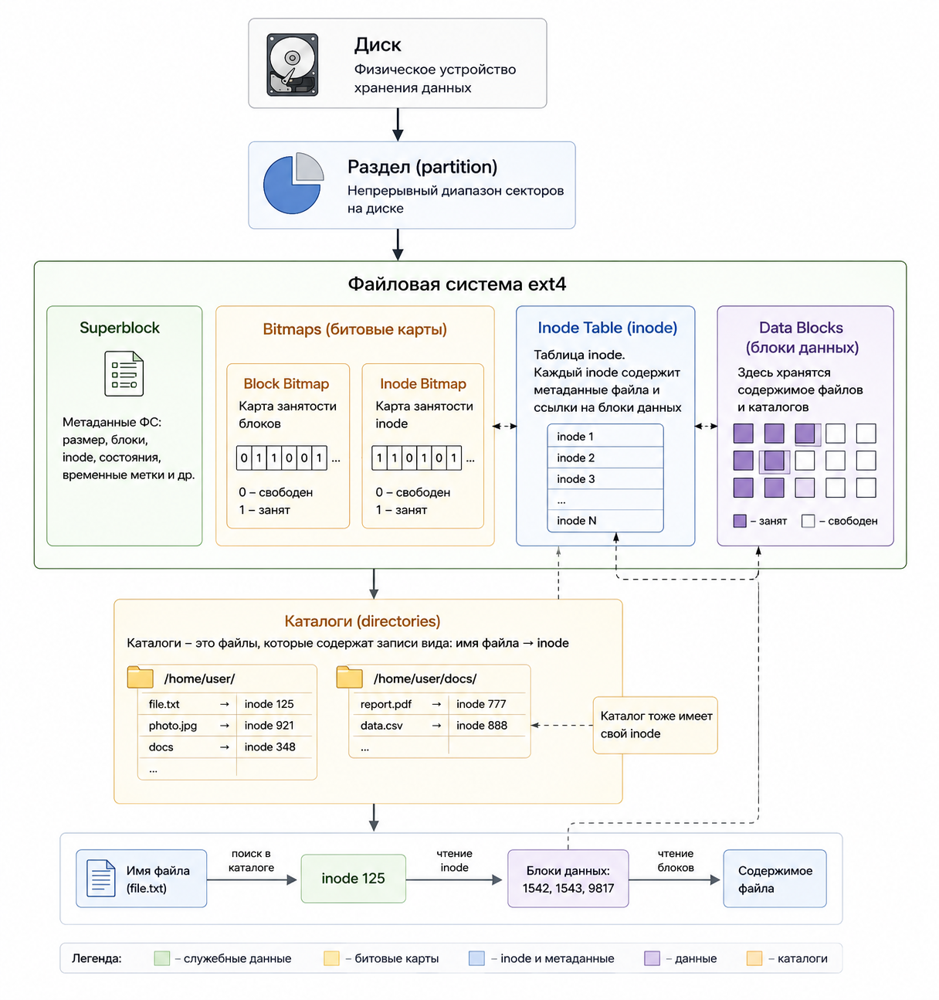

# Как Linux хранит файлы

Всё начинается с устройства хранения:

- **HDD** — классический жесткий диск с вращающимися магнитными пластинами. Стоит дешевле и отлично подходит для хранения больших объёмов данных, но работает медленнее SSD.
- **SSD** — твердотельный накопитель на микросхемах памяти. Работает в 5–20 раз быстрее HDD, не шумит и лучше переносит удары и вибрации.

Конечно, существуют и другие типы накопителей: **NVMe SSD**, **USB-флешки**, **SD-карты** и многие другие.



Пространство диска логически разбито на равные части — **сектора**.
**Сектор** — минимальная адресуемая единица хранения данных на диске, размер которой обычно составляет **512 байт** или **4096 байт**.

Для удобства организации данных диск разделён на **разделы (partitions)**.
**Раздел** — это непрерывный диапазон секторов, который операционная система воспринимает как отдельную область хранения. На одном физическом диске может находиться несколько разделов.

Однако сам по себе раздел — это всего лишь область диска. Чтобы на нём можно было хранить файлы, его необходимо отформатировать, то есть создать на нём файловую систему.

В Linux наиболее распространены **ext4**, **Btrfs**, **XFS**, а в Windows — **NTFS**, **FAT32**, **exFAT** и другие. Именно файловая система определяет, как данные будут организованы и храниться внутри раздела.



---
После создания файловой системы пространство раздела организуется в несколько служебных структур. Каждая из них выполняет свою задачу.

## Суперблок (Superblock)

Superblock - содержит основную информацию о файловой системе:

- тип файловой системы (например, `ext4`);
- размер файловой системы;
- размер блока;
- общее количество блоков;
- количество inode;
- число свободных блоков и inode;
- UUID файловой системы;
- время последней проверки и монтирования;
- другие служебные параметры.

При монтировании файловой системы ядро Linux сначала считывает суперблок, чтобы узнать её параметры и проверить целостность.

В большинстве современных файловых систем предусмотрены механизмы защиты суперблока. Например, файловые системы семейства **ext** создают несколько резервных копий суперблока, расположенных в разных местах раздела. Это позволяет восстановить файловую систему даже при повреждении основного суперблока.

---

## Блоки данных (Data Blocks)

Data Blocks - минимальная единица пространства, которую файловая система может выделить под хранение данных. 
В большинстве современных файловых систем размер блока по умолчанию составляет **4 КБ**, хотя в зависимости от файловой системы и её настроек он может отличаться.

Блок состоит из одного или нескольких секторов. 
Например, если размер сектора составляет **512 байт**, а размер блока — **4 КБ**, то один блок будет включать **8 секторов**.

Даже если файл занимает всего **1 байт**, ему всё равно будет выделен целый блок. Если же размер файла превышает размер одного блока, файловая система выделит несколько блоков.

Например, при размере блока **4 КБ**:

- файл размером **1 байт** займёт **1 блок (4 КБ)**;
- файл размером **6 КБ** займёт **2 блока (8 КБ)**;
- файл размером **10 МБ** будет занимать несколько тысяч блоков.

Блоки не обязательно располагаются подряд. Если на диске недостаточно свободного непрерывного пространства, файловая система может разместить части файла в разных блоках, а информацию об их расположении сохранить в inode.

> Именно блок является минимальной единицей выделения пространства, а не сектор.

---

## Битовые карты (Bitmaps)

Теперь возникает вопрос: как файловая система определяет, какие блоки свободны, а какие уже заняты?

Для этого используются **битовые карты (bitmaps)** — специальные таблицы, в которых каждому блоку соответствует один бит.

Принцип работы очень простой:

- `0` — блок свободен;
- `1` — блок занят.

Например, такая битовая карта:

```text
0 1 1 0 0 1 1 1
```

означает, что:

- блок №0 — свободен;
- блоки №1 и №2 — заняты;
- блоки №3 и №4 — свободны;
- остальные — заняты.

Когда создаётся новый файл, файловая система просматривает битовую карту, находит свободные блоки, помечает их как занятые и записывает в них данные файла.

Аналогичная битовая карта существует и для inode. Она позволяет быстро определить, какие inode уже используются, а какие ещё свободны для создания новых файлов.

Благодаря битовым картам файловой системе не нужно просматривать весь диск в поисках свободного места — достаточно проверить соответствующие биты.

---

## inode (Index Node)

Хорошо, свободный блок найден. Но где хранится информация о самом файле — его размере, владельце, правах доступа и о том, какие блоки ему принадлежат?

Для этого существует **inode**.

**inode** — это структура данных, которая содержит все метаданные файла и ссылки на блоки данных, но не хранит имя файла и само содержимое.

В inode хранится:

- тип объекта (обычный файл, каталог, символическая ссылка и т.д.);
- права доступа;
- владелец и группа;
- размер файла;
- время создания, изменения и последнего доступа;
- количество жёстких ссылок;
- указатели на блоки данных, в которых хранится содержимое файла.

Например, если файл занимает три блока, inode будет хранить ссылки именно на них:

```text
inode №125

Размер: 10 КБ
Владелец: user
Права: rw-r--r--

Блоки данных:
 ├── 1542
 ├── 1543
 └── 9817
```

> **Обратите внимание:** имени файла в inode нет.

inode знает всё о файле и о том, где находятся его данные, но не знает, как этот файл называется.

Именно поэтому в Linux можно создать несколько имён, указывающих на один и тот же inode. Такие имена называются **жёсткими ссылками (hard links)**, но про в другой раз.

---

## Каталог

Мы выяснили, что inode содержит всю информацию о файле, кроме его имени.

Возникает вопрос: **где тогда хранится имя файла?**

Ответ: **в каталоге**.

В Linux каталог — это тоже обычный файл, но вместо пользовательских данных он хранит список записей следующего вида:

```text
README.md  → inode 125
file.txt   → inode 348
photo.jpg  → inode 921
```

Каждая запись содержит всего две вещи:

- имя файла;
- номер соответствующего inode.

Когда вы открываете файл `/home/user/file.txt`, операционная система последовательно проходит по каталогам (`/`, `home`, `user`), пока не найдёт запись `file.txt`.

Из неё она получает номер inode, затем считывает inode, узнаёт, в каких блоках находятся данные файла, и только после этого читает его содержимое.

Поскольку каталог сам является файлом, у него тоже есть собственный inode.


