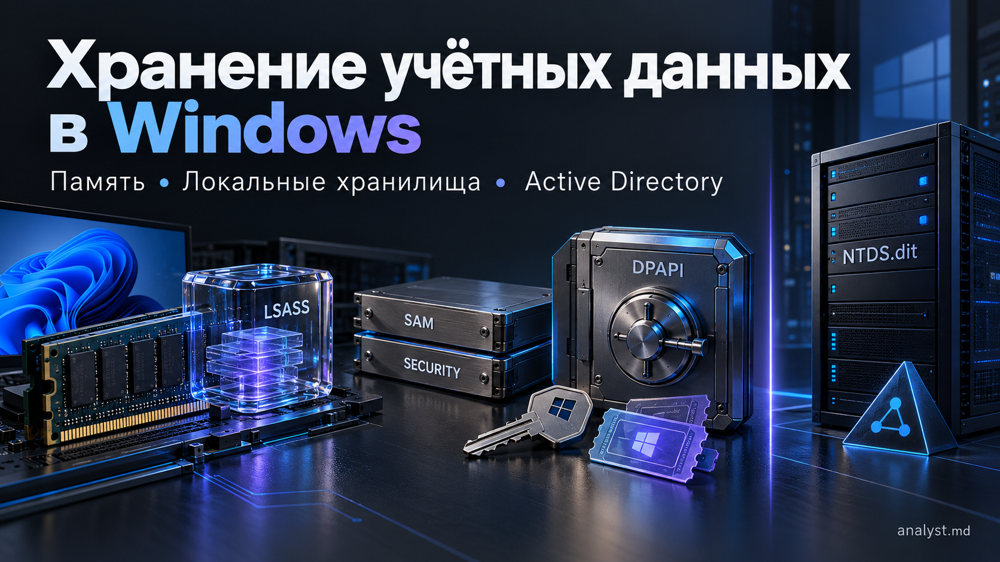
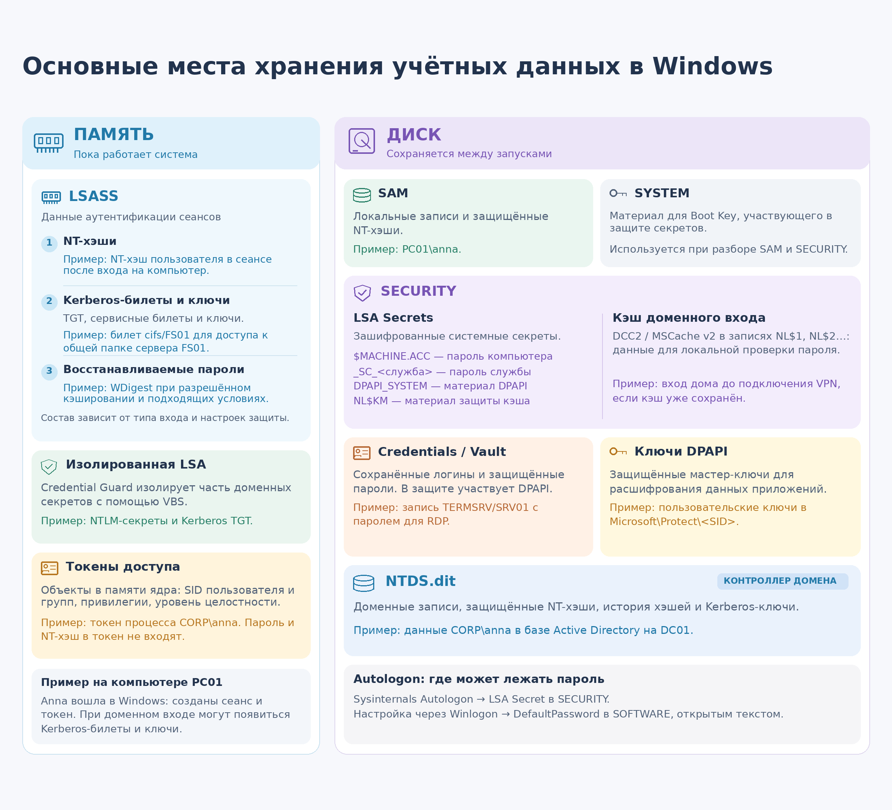

Основные места хранения учётных данных и связанных с ними данных безопасности в Windows - **оперативная память** и **диск**.

| Место хранения | Основные данные и хранилища |
|---|---|
| **Оперативная память** | NT-хэши, Kerberos-билеты и ключи, а в отдельных сценариях - обратимо защищённые пароли. Здесь же находятся токены доступа |
| **Диск** | SAM, SECURITY, NTDS.dit, файлы сохранённых учётных данных и ключевой материал DPAPI |



## Что именно хранит Windows

Термин «учётные данные» часто используют слишком широко. Для анализа полезно различать сами секреты, данные для проверки доступа и механизмы их хранения.

| Данные или хранилище | Что это и зачем нужно |
|---|---|
| **Пароль** | Исходный секрет пользователя или служебной учётной записи |
| **NT-хэш** | Производное пароля, используемое при проверке пароля и в механизмах аутентификации |
| **Kerberos-ключи** | Долговременные ключи учётной записи и временные сеансовые ключи |
| **Kerberos-билеты** | TGT - для получения сервисных билетов; сервисные билеты - для обращения к конкретным службам |
| **Cached Domain Credentials** | Данные для локальной проверки доменного входа при недоступности контроллера домена |
| **LSA Secrets** | Хранилище защищённых системных секретов: пароля учётной записи компьютера, паролей служб, ключевого материала DPAPI и других данных |
| **Учётные данные в Credential Manager** | Сохранённые данные для последующей аутентификации, например логин и пароль для RDP-подключения |
| **Windows access token** | Контекст безопасности, используемый при проверке прав доступа |

## 1. LSASS: аутентификационные данные в памяти

**`lsass.exe` - Local Security Authority Subsystem Service.** Процесс обслуживает подсистему безопасности Windows - **LSA (Local Security Authority)**: участвует в проверке учётных данных, ведении сеансов входа и работе пакетов аутентификации.

В зависимости от способа входа и конфигурации в памяти могут находиться **NT-хэши, Kerberos-билеты, сеансовые и долговременные ключи**, а в некоторых сценариях - **обратимо защищённые пароли**. Эти данные позволяют обращаться к ресурсам без повторного запроса пароля - реализовать **Single Sign-On (SSO)**.

LSASS использует компоненты, реализующие разные механизмы:

- **MSV1_0** - участвует в проверке локального входа по паролю и NTLM-аутентификации.
- **Kerberos** - обслуживает Kerberos-аутентификацию, билеты и связанные ключи.
- **Negotiate** - позволяет выбрать подходящий протокол: Kerberos или NTLM.

Наличие LSASS не означает, что в нём всегда хранятся открытые пароли всех пользователей. Содержимое зависит от типа входа, пакетов аутентификации и защитных механизмов.

При включённом **Credential Guard** часть доменных секретов, включая поддерживаемые NTLM-секреты и Kerberos TGT, изолируется с помощью **VBS - безопасности на основе виртуализации**. Они защищены в изолированной LSA, с которой взаимодействует обычный процесс LSASS. Сервисные Kerberos-билеты этой защитой не охватываются.

### Почему важен тип входа

| Тип входа | Пример | Что учитывать при расследовании |
|---|---|---|
| **2 - Interactive** | Вход за компьютером | Может создавать сеанс с учётными данными для последующей сетевой аутентификации |
| **3 - Network** | Доступ к общей папке по SMB | При обычном входе без делегирования пароль, NT-хэш и TGT клиента на принимающем сервере не кэшируются вследствие этого подключения |
| **4 - Batch** | Задание планировщика | Набор данных зависит от способа запуска и сохранения учётных данных |
| **5 - Service** | Запуск службы | Вход с паролем служебной записи отличается от запуска под встроенной учётной записью |
| **9 - NewCredentials** | `runas /netonly` | Отдельные учётные данные используются для исходящих сетевых подключений |
| **10 - RemoteInteractive** | RDP | Обычный вход может размещать учётные данные для последующей аутентификации на удалённом хосте |

Это типичные сценарии, а не гарантия наличия конкретного секрета. Делегирование и режимы защиты, например Remote Credential Guard и Restricted Admin для RDP, меняют набор доступных данных.

**Пример:** пользователь работает за компьютером `PC01` и через Проводник открывает общую папку `Reports` на файловом сервере `FS01`. Её сетевой путь - `\\FS01\Reports`, где `FS01` - имя сервера, а `Reports` - имя общей папки. На `FS01` создаётся сетевой сеанс входа типа 3.

На сервере создаётся контекст безопасности пользователя и могут сохраняться данные, необходимые для текущего соединения, например сеансовые ключи. При Kerberos сервер обрабатывает предъявленный сервисный билет, при NTLM - ответ на запрос сервера (*challenge*). Получение этих данных не означает, что каждый элемент обмена сохраняется в памяти на всё время сеанса.

При обычном сетевом входе без делегирования **пароль, NT-хэш и TGT клиента на `FS01`, как правило, не передаются и не кэшируются вследствие этого подключения**.

Тип входа помогает оценить, **какие именно данные могли оказаться на сервере и для чего их можно использовать**.

### WDigest и открытые пароли

**WDigest** - компонент Windows, который обеспечивает Digest-аутентификацию, например при обращении к веб-серверу, настроенному на этот способ входа. Чтобы выполнять такую аутентификацию без повторного ввода пароля, WDigest исторически сохранял пароль вошедшего пользователя в памяти LSASS.

Главная особенность такого хранения - **из сохранённых данных можно восстановить исходный пароль в открытом виде, без подбора по хэшу**. Хотя внутри LSASS пароль может быть защищён обратимым шифрованием, после извлечения данных и снятия этой защиты становится доступен сам пароль.

Начиная с **Windows 8.1 и Windows Server 2012 R2** кэширование паролей через WDigest по умолчанию отключено. Его настройку определяет параметр `UseLogonCredential` типа `REG_DWORD` в разделе реестра:

```text
HKLM\SYSTEM\CurrentControlSet\Control\SecurityProviders\WDigest
```

| Значение `UseLogonCredential` | Настройка |
|---|---|
| `0` | Кэширование отключено |
| `1` | Кэширование разрешено |
| Параметр отсутствует | В Windows 8.1 / Server 2012 R2 и более новых версиях по умолчанию кэширование отключено |

**`UseLogonCredential = 1` не заставляет приложения аутентифицироваться по Digest.** Он разрешает WDigest кэшировать пароль после входа в Windows для возможного дальнейшего использования. Пользователь может не открыть ни одного ресурса с Digest, а пароль при соответствующих условиях уже будет сохранён.

Фактическое кэширование зависит также от способа входа и действующих защитных механизмов. Начиная с Windows 11 22H2 Microsoft объявила WDigest устаревающим компонентом (*deprecated*), поэтому его поведение нужно учитывать применительно к конкретной версии ОС.

## 2. Kerberos: пароль, ключи и билеты

В домене Active Directory **KDC (Key Distribution Center)** - служба на контроллере домена, которая выдаёт Kerberos-билеты.

У Kerberos есть три разные категории данных:

| Категория | Назначение |
|---|---|
| **Долговременный ключ** | Связан с учётной записью; при парольной аутентификации выводится из пароля по правилам выбранного алгоритма |
| **Сеансовый ключ** | Используется при взаимодействии клиента с KDC или конкретной службой |
| **Билет** | Выданное KDC удостоверение для определённой службы с ограниченным сроком действия |

**TGT (Ticket Granting Ticket)** позволяет запрашивать сервисные билеты. **Сервисный билет (service ticket)** предназначен для конкретной службы, например файлового сервера.

Сервисный билет часто называют «TGS-билетом». Строго говоря, **TGS - Ticket Granting Service**, служба выдачи билетов, а `TGS-REQ` и `TGS-REP` - запрос и ответ при получении сервисного билета.

### Пример: открытие сетевой папки

Пользователь `CORP\anna` входит на компьютер `PC01`, когда контроллер домена доступен, и открывает общую папку `Reports` на файловом сервере `FS01`. Сетевой путь к ней - `\\FS01.corp.example\Reports`.

1. При доменном входе клиент проходит первоначальную Kerberos-аутентификацию и получает **TGT и соответствующий сеансовый ключ**.
2. Для доступа к `FS01` клиент использует TGT, чтобы запросить у KDC сервисный билет.
3. KDC выдаёт билет для нужного **SPN (Service Principal Name)** - имени службы, например `cifs/FS01.corp.example`, - и соответствующий сеансовый ключ.
4. Клиент предъявляет `FS01` сервисный билет и **authenticator** - данные, подтверждающие владение соответствующим ключом.
5. После аутентификации сервер отдельно проверяет права на папку.

Сам по себе билет не содержит доступного клиенту пароля. Для использования билета важен и соответствующий сеансовый ключ.

Windows ведёт **кэш Kerberos-билетов по сеансам входа**. Посмотреть билеты своего текущего сеанса можно командой:

```powershell
klist
```

В выводе можно увидеть клиента, сервер/SPN, сроки действия и типы шифрования.

## 3. Access token: данные для проверки прав доступа

После успешного входа пользователя Windows создаёт **access token - токен доступа**. Он хранится **в оперативной памяти как объект ядра Windows** и содержит SID пользователя, SID групп, привилегии и уровень целостности. **SID (Security Identifier)** - идентификатор субъекта безопасности, например пользователя или группы.

Процессы и потоки используют связанные с ними токены при проверке прав доступа. **Сам токен не содержит пароль или NT-хэш**: он описывает контекст безопасности, в котором выполняются действия.

## 4. SAM и SYSTEM: локальные учётные записи

**SAM (Security Account Manager)** содержит сведения о локальных учётных записях, в том числе защищённые NT-хэши паролей. Это постоянное хранилище: данные не исчезают после выхода пользователя.

| Улей | Расположение в реестре | Файл по умолчанию |
|---|---|---|
| **SAM** | `HKLM\SAM` | `C:\Windows\System32\config\SAM` |
| **SYSTEM** | `HKLM\SYSTEM` | `C:\Windows\System32\config\SYSTEM` |
| **SECURITY** | `HKLM\SECURITY` | `C:\Windows\System32\config\SECURITY` |

**Улей** - логическая часть реестра; соответствующий файл содержит его данные на диске. `HKLM` - сокращение от `HKEY_LOCAL_MACHINE`. В примерах предполагается, что Windows установлена в `C:\Windows`.

### Что такое NT-хэш

**NT-хэш**, часто называемый NTLM-хэшем, вычисляется так:

```text
NT-хэш = MD4(UTF-16LE(пароль))
```

Результат занимает **16 байт**. Соль при вычислении NT-хэша не используется: одинаковые пароли дают одинаковые хэши.

В SAM хэш дополнительно защищён шифрованием. Это два разных уровня: **пароль преобразуется в хэш, а хэш шифруется для хранения**. Снятие шифрования с записи даёт хэш, а не исходный пароль.

### Зачем нужен SYSTEM

В SYSTEM находятся данные для восстановления **Boot Key** - системного ключа. Он участвует в защите ключевого материала SAM, используемого для расшифрования записей с хэшами.

Поэтому при **офлайн-анализе**, то есть анализе скопированных файлов вне исходной работающей системы, обычно нужна пара **SAM + SYSTEM от одной установки Windows** либо SAM и уже известный подходящий ключ. SYSTEM не является второй базой пользовательских паролей.

Локальная запись `PC01\anna` и доменная запись `CORP\anna` - разные учётные записи. **Вход доменного пользователя на компьютер не создаёт его копию в локальной SAM.**

## 5. SECURITY и LSA Secrets

**SECURITY** - улей реестра Windows, который содержит локальную политику безопасности и защищённые данные. На диске он находится в файле:

```text
C:\Windows\System32\config\SECURITY
```

Внутри улья находятся две отдельные категории данных:

| Раздел реестра | Содержимое |
|---|---|
| `HKLM\SECURITY\Policy\Secrets` | **LSA Secrets** - системные секреты |
| `HKLM\SECURITY\Cache` | **Кэш доменного входа** - проверочные данные для входа при недоступности контроллера домена |

**LSA Secrets** - хранилище паролей и криптографического ключевого материала, которые нужны Windows для системных задач, в том числе после перезагрузки.

| Пример секрета | Что хранится и для чего используется |
|---|---|
| `$MACHINE.ACC` | Пароль доменной учётной записи компьютера, используемый для его аутентификации в домене |
| `_SC_<имя_службы>` | Сохранённый пароль учётной записи, под которой настроен запуск конкретной службы |
| `DPAPI_SYSTEM` | Ключевой материал для защиты данных через DPAPI в системном контексте |
| `NL$KM` | Ключевой материал для защиты записей кэша доменного входа |
| `DefaultPassword` | Пароль автоматического входа, если он сохранён через механизм LSA Secrets |

Набор секретов зависит от настроек компьютера: не все перечисленные записи обязательно присутствуют на каждом хосте.

**Пример:** администратор настроил службу резервного копирования на запуск под учётной записью `CORP\svc_backup` и указал её пароль. Windows сохраняет его как LSA Secret, чтобы запускать службу после перезагрузки без повторного ввода пароля. Для службы, работающей под встроенной учётной записью **LocalSystem**, сохранение такого пользовательского пароля не требуется.

### Как защищены LSA Secrets

Содержимое LSA Secrets хранится **в зашифрованном виде**. В его защите участвует ключевой материал из улья SYSTEM той же установки Windows. Поэтому для офлайн-разбора обычно используют пару **SECURITY + SYSTEM**.

Сохранённые пароли защищены обратимо: Windows должна иметь возможность восстановить их для использования. Получение необходимых данных и ключей может позволить извлечь **исходный пароль**, а не только его хэш.

### Особенность хранения пароля автоматического входа

**Автоматический вход, или Autologon,** позволяет Windows входить под указанной учётной записью без ручного ввода пароля. Место хранения этого пароля зависит от способа настройки:

| Способ настройки | Где и в каком виде хранится пароль |
|---|---|
| Через параметры реестра Winlogon | Открытым текстом в параметре `DefaultPassword` раздела `HKLM\SOFTWARE\Microsoft\Windows NT\CurrentVersion\Winlogon` |
| Через утилиту Sysinternals Autologon | В зашифрованном виде как LSA Secret с именем `DefaultPassword` в улье SECURITY |

Несмотря на одинаковое имя `DefaultPassword`, это разные записи в разных разделах реестра. Пароль автоматического входа может находиться как в **SECURITY**, так и в **SOFTWARE** - в зависимости от выбранного способа настройки.

## 6. Cached Domain Credentials: вход без контроллера домена

При входе под доменной учётной записью Windows обычно обращается к **контроллеру домена - DC (Domain Controller)** для проверки учётных данных. Но контроллер может быть недоступен: например, компьютер находится вне корпоративной сети, VPN ещё не подключён или возникли проблемы со связью.

Чтобы пользователь мог войти на компьютер в такой ситуации, при разрешённом кэшировании Windows сохраняет **кэш доменного входа - данные для локальной проверки введённого пароля**.

**Пример удалённой работы:** сотрудник работает из дома на доменном ноутбуке. Ранее он уже успешно входил на этот ноутбук, когда контроллер домена был доступен, и Windows сохранила кэш его входа.

После перезагрузки VPN ещё не подключён, поэтому связаться с контроллером домена невозможно. Сотрудник вводит доменный логин и пароль, Windows проверяет их по локальному кэшу и разрешает вход. После этого сотрудник может подключить VPN для доступа к корпоративным ресурсам.

Такой вход возможен, если для пользователя уже существует подходящая запись кэша и кэширование разрешено политиками. **Первый вход нового доменного пользователя на компьютер без связи с контроллером домена таким способом выполнить нельзя.**

### Где хранится кэш

Кэш находится в улье SECURITY:

```text
Файл:   C:\Windows\System32\config\SECURITY
Реестр: HKLM\SECURITY\Cache
```

Записи размещаются в значениях `NL$1`, `NL$2` и далее. Для их защиты используется ключевой материал **`NL$KM`**, который хранится отдельно - в LSA Secrets.

### Что именно сохраняется

В современных Windows используется **DCC2, также известный как MSCache v2**. Это проверочное значение, вычисленное из пароля с участием имени пользователя и дополнительной обработки алгоритмом **PBKDF2-HMAC-SHA1**.

При входе без контроллера домена Windows вычисляет проверочное значение для введённого пароля и сравнивает его с сохранённым. **Сам исходный пароль для такой проверки хранить не требуется.**

DCC2 отличается от NT-хэша: его нельзя напрямую использовать для обычного **Pass-the-Hash** - аутентификации с использованием NT-хэша без знания пароля. Однако извлечённое значение позволяет подбирать пароль офлайн: вычислять значения для предполагаемых паролей и сравнивать результат.

Кэш обеспечивает **локальный вход на компьютер**. Успешный вход по кэшу сам по себе не выдаёт новый Kerberos TGT: для этого нужен доступ к KDC.

Количество пользователей, для которых сохраняется кэш, регулируется политикой **Interactive logon: Number of previous logons to cache (in case domain controller is not available)**. Значение `0` отключает кэширование доменных входов.

## 7. Credential Manager и DPAPI

### Credential Manager: сохранённые учётные данные

**Credential Manager, или «Диспетчер учётных данных»,** - механизм Windows для сохранения логинов, паролей и других данных, которые используются при последующей аутентификации. Пользователь может добавить запись вручную, а поддерживающее этот механизм приложение - сохранить её по запросу пользователя.

**Пример:** сотрудник подключается через «Подключение к удалённому рабочему столу» к серверу `SRV01`. На своём компьютере он работает под обычной учётной записью, а для входа на сервер использует отдельную - `CORP\admin_anna`.

При подключении сотрудник вводит логин и пароль и выбирает сохранение учётных данных. Если это разрешено политиками, клиент RDP сохраняет запись для сервера. При следующем подключении он может использовать её, чтобы не запрашивать пароль повторно.

Такая запись обычно содержит:

- **целевой ресурс** - например, `TERMSRV/SRV01` для RDP;
- **имя пользователя** - `CORP\admin_anna`;
- **защищённый секрет** - в данном примере пароль.

На компьютере могут храниться учётные данные **для других систем и других пользователей**, а не только данные текущей учётной записи Windows.

### Как посмотреть сохранённые записи

Открыть их можно через **Панель управления → Диспетчер учётных данных → Учётные данные Windows**.

Для просмотра из командной строки:

```powershell
cmdkey /list
```

Команда показывает список записей, включая целевые ресурсы и имена пользователей, но **не выводит сохранённые пароли**. Это список поддерживаемых записей Credential Manager, а не всех секретов, которые когда-либо сохраняли приложения.

### Где находятся данные на диске

Windows использует **Credential-файлы** и **хранилища Vault**. Основные каталоги:

| Артефакты | Путь |
|---|---|
| Credential-файлы в перемещаемой части профиля | `%APPDATA%\Microsoft\Credentials` |
| Credential-файлы в локальной части профиля | `%LOCALAPPDATA%\Microsoft\Credentials` |
| Пользовательские хранилища Vault | `%LOCALAPPDATA%\Microsoft\Vault` |
| Vault системного профиля | `%SystemRoot%\System32\config\systemprofile\AppData\Local\Microsoft\Vault` |

Для пользователя Anna переменные обычно раскрываются так:

```text
%APPDATA%      → C:\Users\Anna\AppData\Roaming
%LOCALAPPDATA% → C:\Users\Anna\AppData\Local
```

Секреты в этих хранилищах защищены шифрованием; в их защите участвует **DPAPI**. Пользовательские мастер-ключи DPAPI находятся отдельно:

```text
%APPDATA%\Microsoft\Protect\<SID>
```

Набор каталогов зависит от версии ОС, профиля и приложений, использующих эти механизмы. Наличие каталога само по себе не доказывает, что в нём есть действующий пароль.

### Что делает DPAPI

**DPAPI - Data Protection API** - механизм Windows, с помощью которого приложения шифруют пароли, ключи и другие конфиденциальные данные перед сохранением на диск.

**Пример:** приложение должно запомнить пароль для подключения к серверу. Оно передаёт пароль DPAPI, получает зашифрованные данные и сохраняет их в файл. Когда пароль снова понадобится, приложение передаёт эти данные DPAPI для расшифрования.

Для этого DPAPI использует **мастер-ключи - Master Keys**. Они тоже хранятся на диске в защищённом виде. Типичный путь к пользовательским мастер-ключам:

```text
C:\Users\<пользователь>\AppData\Roaming\Microsoft\Protect\<SID>
```

Здесь `<SID>` - идентификатор пользователя.

На диске находятся два разных вида данных:

| Что хранится | Содержимое |
|---|---|
| Файл приложения или запись хранилища | Зашифрованный секрет, например пароль |
| Файл Master Key | Защищённый ключевой материал, необходимый для расшифрования |

Защита DPAPI может быть привязана к **пользователю** или **компьютеру**. Простого копирования файла с зашифрованным паролем обычно недостаточно: нужны соответствующие ключи и возможность использовать их.

**DPAPI не хранит все пароли в одном месте - он защищает данные, которые Windows и приложения сохраняют в своих хранилищах.**

## 8. NTDS.dit: учётные данные домена

**NTDS.dit - файл базы данных Active Directory**, расположенный на контроллере домена. По умолчанию он находится по пути:

```text
C:\Windows\NTDS\ntds.dit
```

При развёртывании контроллера домена можно выбрать другой путь.

База содержит сведения о доменных пользователях, компьютерах, группах и других объектах. Вместе с ними хранятся **данные для аутентификации доменных учётных записей**:

- **NT-хэши паролей**;
- **история NT-хэшей** - в зависимости от политики хранения истории паролей;
- **Kerberos-ключи** и другие дополнительные аутентификационные данные.

**Пример:** администратор создаёт пользователя `CORP\anna` и задаёт ему пароль. В Active Directory сохраняются сведения об учётной записи и аутентификационные данные, вычисленные на основе пароля. Контроллер домена использует эти данные для проверки подлинности пользователя.

### Как защищены данные

Чувствительные атрибуты в NTDS.dit зашифрованы. Для их расшифрования при анализе скопированной базы нужны соответствующие ключи. В классической схеме офлайн-разбора используют **NTDS.dit и улей SYSTEM с того же контроллера домена**: SYSTEM содержит материал для получения системного ключа, который позволяет снять защиту с ключей базы и затем расшифровать секретные атрибуты.

Одной копии NTDS.dit без необходимого ключевого материала обычно недостаточно для извлечения хэшей и ключей.

**Обычная рабочая станция - участник домена не получает копию NTDS.dit.** При этом данные активного доменного сеанса могут находиться в её памяти, а кэш доменного входа - в локальном улье SECURITY.

## 9. Один пользователь - несколько разных следов

Анна работает на компьютере **PC01** под доменной учётной записью **`CORP\anna`**. **DC01** - контроллер домена, **FS01** - файловый сервер, **SRV01** - сервер для подключения по RDP.

Ниже рассмотрена обычная парольная доменная аутентификация. Конкретный набор секретов зависит от способа входа и политик.

| Действие | Что появляется или используется | Где появляется или хранится |
|---|---|---|
| Входит на PC01, когда DC01 доступен | Создаются сеанс входа и токен доступа; при Kerberos-аутентификации клиент получает TGT и связанные ключи | **На PC01:** аутентификационный материал - в LSASS / изолированной LSA; токен доступа - в памяти ядра. **DC01** проверяет аутентификацию и выдаёт TGT |
| При этом разрешено кэширование доменного входа | Создаётся или обновляется запись кэша для последующего входа без связи с контроллером домена | **На PC01:** улей SECURITY, раздел `HKLM\SECURITY\Cache` |
| Открывает общую папку Reports на FS01 по Kerberos | Клиент получает сервисный билет для файлового сервера; сервер создаёт контекст безопасности для обслуживания подключения | **На PC01:** сервисный билет и соответствующий ключ в кэше Kerberos. **На FS01:** контекст безопасности принятого соединения и связанные сеансовые данные |
| Сохраняет отдельные логин и пароль для подключения к SRV01 по RDP | Создаётся запись сохранённых учётных данных, если это разрешено политиками | **На PC01, откуда выполняется подключение:** Credential Manager. Само сохранение пароля клиентом не создаёт такую же запись на SRV01 |
| Успешно входит на SRV01 по RDP с паролем в обычном режиме | Создаётся удалённый интерактивный сеанс; могут появиться учётные данные для последующей сетевой аутентификации | **На SRV01:** аутентификационный материал сеанса - в LSASS / изолированной LSA, токен - в памяти ядра. Remote Credential Guard и Restricted Admin меняют эту картину |
| Блокирует PC01 | Сеанс входа продолжает существовать; блокировка сама по себе не очищает все его аутентификационные данные | **На PC01:** в памяти сохраняются данные действующего сеанса |
| Перезагружает PC01 и входит, когда DC01 недоступен | Windows проверяет пароль по ранее сохранённому кэшу и создаёт новый сеанс входа и токен доступа. Новый TGT без связи с KDC не выдаётся | **На PC01:** используется кэш из SECURITY; новый токен находится в памяти ядра |

Данные одного пользователя могут одновременно находиться на нескольких хостах и иметь разное назначение. При анализе важно указывать **какие данные обнаружены, на каком компьютере и в каком хранилище**.

## 10. Как применять это в SOC и DFIR

Источник, к которому обращался подозрительный процесс, помогает сформулировать гипотезу:

| Наблюдение | Что проверить |
|---|---|
| **Доступ к LSASS или создание его дампа** | Тип доступа, инициатор, успешность операции, существовавшие сеансы, настройки защиты LSASS - PPL - и Credential Guard |
| **Сохранение или копирование SAM и SYSTEM** | Возможное получение локальных хэшей; легитимность резервного копирования или сбора триажа |
| **Обращение к SECURITY вместе с SYSTEM** | Возможный интерес к LSA Secrets и кэшу доменных входов |
| **Доступ к NTDS.dit или его копиям** | Возможную компрометацию доменных секретов и объём затронутых данных |
| **Массовое чтение Credentials, Vault и Protect** | Возможный сбор сохранённых учётных данных и ключевого материала DPAPI |
| **Изменение параметров WDigest или защиты LSA** | Возможную подготовку к последующему получению секретов |

Это **аналитические гипотезы**, а не однозначные признаки атаки. Сборщики триажа, EDR, резервное копирование и административные инструменты тоже могут обращаться к чувствительным объектам.

При соответствующей настройке **Sysmon** полезны следующие события:

| Event ID | Событие | Что показывает |
|---|---|---|
| **1** | Process Create | Создание процесса, его командную строку и сведения о родительском процессе |
| **10** | Process Access | Обращение одного процесса к другому, в том числе к LSASS |
| **11** | File Create | Создание или перезапись файла, например файла дампа |
| **12–14** | Registry Event | Создание, удаление и переименование ключей/значений реестра, а также установку значений |

Например, **Event ID 10 с целью `lsass.exe` показывает обращение к процессу, но не доказывает успешное извлечение учётных данных**. Sysmon также не является универсальным средством регистрации каждого чтения файла.

## 11. Справочная таблица

| Источник | Основное содержимое | Где находится | С чем не путать |
|---|---|---|---|
| **LSASS / изолированная LSA** | Аутентификационный материал сеансов | Оперативная память; часть секретов может быть изолирована VBS | Постоянная база всех пользователей |
| **SAM** | Данные локальных записей и защищённые NT-хэши | Улей SAM | Доменные записи AD |
| **SYSTEM** | Конфигурация и материал для Boot Key | Улей SYSTEM | База паролей |
| **LSA Secrets** | Системные и служебные секреты | `HKLM\SECURITY\Policy\Secrets` | Только NT-хэши пользователей |
| **Cached Domain Credentials** | Проверочный материал для входа без DC | `HKLM\SECURITY\Cache` | NT-хэш или Kerberos TGT |
| **Credential Manager / Vault** | Сохранённые учётные данные | Профиль пользователя и системные хранилища | Все секреты всех приложений |
| **DPAPI Master Keys** | Ключевой материал защиты данных | Каталоги Protect | Сами сохранённые пароли |
| **NTDS.dit** | Данные доменных записей и защищённые секреты | Контроллер домена | Локальная SAM рабочей станции |
| **Windows access token** | SID, группы, привилегии и другие атрибуты | Объект ядра в оперативной памяти | Пароль, NT-хэш или OAuth-токен |

## Источники

- [Microsoft: Credentials processes in Windows authentication](https://learn.microsoft.com/en-us/windows-server/security/windows-authentication/credentials-processes-in-windows-authentication) - LSASS, пакеты аутентификации и хранилища.
- [Microsoft: Administrative tools and logon types](https://learn.microsoft.com/en-us/windows-server/identity/securing-privileged-access/reference-tools-logon-types) - типы входа и размещение учётных данных.
- [Microsoft: How Credential Guard works](https://learn.microsoft.com/en-us/windows/security/identity-protection/credential-guard/how-it-works) - изоляция секретов и границы защиты.
- [Microsoft: WDigest settings](https://support.microsoft.com/en-us/security/microsoft-security-advisory-update-to-improve-credentials-protection-and-management-may-13-2014) - параметр `UseLogonCredential` и поведение по умолчанию.
- [Microsoft: Microsoft Digest SSP](https://learn.microsoft.com/en-us/windows/win32/secauthn/microsoft-digest-ssp) - назначение и статус WDigest.
- [RFC 4120: The Kerberos Network Authentication Service (V5)](https://www.rfc-editor.org/rfc/rfc4120) - билеты и ключи Kerberos.
- [Microsoft: Access tokens](https://learn.microsoft.com/en-us/windows/win32/secauthz/access-tokens) и [Kernel objects](https://learn.microsoft.com/en-us/windows/win32/sysinfo/kernel-objects) - содержимое и размещение токенов доступа.
- [Microsoft: Passwords technical overview](https://learn.microsoft.com/en-us/windows-server/security/kerberos/passwords-technical-overview) - хранение хэшей в SAM и AD.
- [Microsoft: Configure Windows to automate logon](https://learn.microsoft.com/en-us/troubleshoot/windows-server/user-profiles-and-logon/turn-on-automatic-logon) - варианты хранения пароля Autologon.
- [Microsoft: Cached domain logon information](https://learn.microsoft.com/en-us/troubleshoot/windows-server/user-profiles-and-logon/cached-domain-logon-information) - назначение и настройка кэшированного входа.
- [Openwall: MSCash2 Algorithm](https://openwall.info/wiki/MSCash2-Algorithm) - вычисление DCC2.
- [Microsoft: cmdkey](https://learn.microsoft.com/en-us/windows-server/administration/windows-commands/cmdkey) и [klist](https://learn.microsoft.com/en-us/windows-server/administration/windows-commands/klist) - просмотр записей и билетов.
- [Microsoft: CryptProtectData](https://learn.microsoft.com/en-us/windows/win32/api/dpapi/nf-dpapi-cryptprotectdata) - защита данных через DPAPI.
- [Passcape: DPAPI Secrets](https://www.passcape.com/text/articles/dpapi.pdf) - устройство DPAPI и размещение мастер-ключей.
- [Fortra Impacket: secretsdump.py](https://github.com/fortra/impacket/blob/master/impacket/examples/secretsdump.py) - реализация разбора защищённых записей SAM, SECURITY и NTDS.dit.
- [Microsoft: Sysmon](https://learn.microsoft.com/en-us/sysinternals/downloads/sysmon) - назначение событий телеметрии.

| Место хранения | Основные данные и хранилища |
|---|---|
| **Оперативная память** | NT-хэши, Kerberos-билеты и ключи, а в отдельных сценариях - обратимо защищённые пароли. Здесь же находятся токены доступа |
| **Диск** | SAM, SECURITY, NTDS.dit, файлы сохранённых учётных данных и ключевой материал DPAPI |

В статье рассматриваются локальные учётные записи и домен **Active Directory (AD)**. Токены доступа включены отдельно: они относятся к проверке прав, а не к доказательству личности пользователя.

## Что именно хранит Windows

Термин «учётные данные» часто используют слишком широко. Для анализа полезно различать сами секреты, данные для проверки доступа и механизмы их хранения.

| Данные или хранилище | Что это и зачем нужно |
|---|---|
| **Пароль** | Исходный секрет пользователя или служебной учётной записи |
| **NT-хэш** | Производное пароля, используемое при проверке пароля и в механизмах аутентификации |
| **Kerberos-ключи** | Долговременные ключи учётной записи и временные сеансовые ключи |
| **Kerberos-билеты** | TGT - для получения сервисных билетов; сервисные билеты - для обращения к конкретным службам |
| **Cached Domain Credentials** | Данные для локальной проверки доменного входа при недоступности контроллера домена |
| **LSA Secrets** | Хранилище защищённых системных секретов: пароля учётной записи компьютера, паролей служб, ключевого материала DPAPI и других данных |
| **Учётные данные в Credential Manager** | Сохранённые данные для последующей аутентификации, например логин и пароль для RDP-подключения |
| **Windows access token** | Контекст безопасности, используемый при проверке прав доступа |

## 1. LSASS: аутентификационные данные в памяти

**`lsass.exe` - Local Security Authority Subsystem Service.** Процесс обслуживает подсистему безопасности Windows - **LSA (Local Security Authority)**: участвует в проверке учётных данных, ведении сеансов входа и работе пакетов аутентификации.

В зависимости от способа входа и конфигурации в памяти могут находиться **NT-хэши, Kerberos-билеты, сеансовые и долговременные ключи**, а в некоторых сценариях - **обратимо защищённые пароли**. Эти данные позволяют обращаться к ресурсам без повторного запроса пароля - реализовать **Single Sign-On (SSO)**.

LSASS использует компоненты, реализующие разные механизмы:

- **MSV1_0** - участвует в проверке локального входа по паролю и NTLM-аутентификации.
- **Kerberos** - обслуживает Kerberos-аутентификацию, билеты и связанные ключи.
- **Negotiate** - позволяет выбрать подходящий протокол: Kerberos или NTLM.

Наличие LSASS не означает, что в нём всегда хранятся открытые пароли всех пользователей. Содержимое зависит от типа входа, пакетов аутентификации и защитных механизмов.

При включённом **Credential Guard** часть доменных секретов, включая поддерживаемые NTLM-секреты и Kerberos TGT, изолируется с помощью **VBS - безопасности на основе виртуализации**. Они защищены в изолированной LSA, с которой взаимодействует обычный процесс LSASS. Сервисные Kerberos-билеты этой защитой не охватываются.

### Почему важен тип входа

| Тип входа | Пример | Что учитывать при расследовании |
|---|---|---|
| **2 - Interactive** | Вход за компьютером | Может создавать сеанс с учётными данными для последующей сетевой аутентификации |
| **3 - Network** | Доступ к общей папке по SMB | При обычном входе без делегирования пароль, NT-хэш и TGT клиента на принимающем сервере не кэшируются вследствие этого подключения |
| **4 - Batch** | Задание планировщика | Набор данных зависит от способа запуска и сохранения учётных данных |
| **5 - Service** | Запуск службы | Вход с паролем служебной записи отличается от запуска под встроенной учётной записью |
| **9 - NewCredentials** | `runas /netonly` | Отдельные учётные данные используются для исходящих сетевых подключений |
| **10 - RemoteInteractive** | RDP | Обычный вход может размещать учётные данные для последующей аутентификации на удалённом хосте |

Это типичные сценарии, а не гарантия наличия конкретного секрета. Делегирование и режимы защиты, например Remote Credential Guard и Restricted Admin для RDP, меняют набор доступных данных.

**Пример:** пользователь работает за компьютером `PC01` и через Проводник открывает общую папку `Reports` на файловом сервере `FS01`. Её сетевой путь - `\\FS01\Reports`, где `FS01` - имя сервера, а `Reports` - имя общей папки. На `FS01` создаётся сетевой сеанс входа типа 3.

На сервере создаётся контекст безопасности пользователя и могут сохраняться данные, необходимые для текущего соединения, например сеансовые ключи. При Kerberos сервер обрабатывает предъявленный сервисный билет, при NTLM - ответ на запрос сервера (*challenge*). Получение этих данных не означает, что каждый элемент обмена сохраняется в памяти на всё время сеанса.

При обычном сетевом входе без делегирования **пароль, NT-хэш и TGT клиента на `FS01`, как правило, не передаются и не кэшируются вследствие этого подключения**.

Тип входа помогает оценить, **какие именно данные могли оказаться на сервере и для чего их можно использовать**.

### WDigest и открытые пароли

**WDigest** - компонент Windows, который обеспечивает Digest-аутентификацию, например при обращении к веб-серверу, настроенному на этот способ входа. Чтобы выполнять такую аутентификацию без повторного ввода пароля, WDigest исторически сохранял пароль вошедшего пользователя в памяти LSASS.

Главная особенность такого хранения - **из сохранённых данных можно восстановить исходный пароль в открытом виде, без подбора по хэшу**. Хотя внутри LSASS пароль может быть защищён обратимым шифрованием, после извлечения данных и снятия этой защиты становится доступен сам пароль.

Начиная с **Windows 8.1 и Windows Server 2012 R2** кэширование паролей через WDigest по умолчанию отключено. Его настройку определяет параметр `UseLogonCredential` типа `REG_DWORD` в разделе реестра:

```text
HKLM\SYSTEM\CurrentControlSet\Control\SecurityProviders\WDigest
```

| Значение `UseLogonCredential` | Настройка |
|---|---|
| `0` | Кэширование отключено |
| `1` | Кэширование разрешено |
| Параметр отсутствует | В Windows 8.1 / Server 2012 R2 и более новых версиях по умолчанию кэширование отключено |

**`UseLogonCredential = 1` не заставляет приложения аутентифицироваться по Digest.** Он разрешает WDigest кэшировать пароль после входа в Windows для возможного дальнейшего использования. Пользователь может не открыть ни одного ресурса с Digest, а пароль при соответствующих условиях уже будет сохранён.

Фактическое кэширование зависит также от способа входа и действующих защитных механизмов. Начиная с Windows 11 22H2 Microsoft объявила WDigest устаревающим компонентом (*deprecated*), поэтому его поведение нужно учитывать применительно к конкретной версии ОС.

## 2. Kerberos: пароль, ключи и билеты

В домене Active Directory **KDC (Key Distribution Center)** - служба на контроллере домена, которая выдаёт Kerberos-билеты.

У Kerberos есть три разные категории данных:

| Категория | Назначение |
|---|---|
| **Долговременный ключ** | Связан с учётной записью; при парольной аутентификации выводится из пароля по правилам выбранного алгоритма |
| **Сеансовый ключ** | Используется при взаимодействии клиента с KDC или конкретной службой |
| **Билет** | Выданное KDC удостоверение для определённой службы с ограниченным сроком действия |

**TGT (Ticket Granting Ticket)** позволяет запрашивать сервисные билеты. **Сервисный билет (service ticket)** предназначен для конкретной службы, например файлового сервера.

Сервисный билет часто называют «TGS-билетом». Строго говоря, **TGS - Ticket Granting Service**, служба выдачи билетов, а `TGS-REQ` и `TGS-REP` - запрос и ответ при получении сервисного билета.

### Пример: открытие сетевой папки

Пользователь `CORP\anna` входит на компьютер `PC01`, когда контроллер домена доступен, и открывает общую папку `Reports` на файловом сервере `FS01`. Сетевой путь к ней - `\\FS01.corp.example\Reports`.

1. При доменном входе клиент проходит первоначальную Kerberos-аутентификацию и получает **TGT и соответствующий сеансовый ключ**.
2. Для доступа к `FS01` клиент использует TGT, чтобы запросить у KDC сервисный билет.
3. KDC выдаёт билет для нужного **SPN (Service Principal Name)** - имени службы, например `cifs/FS01.corp.example`, - и соответствующий сеансовый ключ.
4. Клиент предъявляет `FS01` сервисный билет и **authenticator** - данные, подтверждающие владение соответствующим ключом.
5. После аутентификации сервер отдельно проверяет права на папку.

Сам по себе билет не содержит доступного клиенту пароля. Для использования билета важен и соответствующий сеансовый ключ.

Windows ведёт **кэш Kerberos-билетов по сеансам входа**. Посмотреть билеты своего текущего сеанса можно командой:

```powershell
klist
```

В выводе можно увидеть клиента, сервер/SPN, сроки действия и типы шифрования.

## 3. Access token: данные для проверки прав доступа

После успешного входа пользователя Windows создаёт **access token - токен доступа**. Он хранится **в оперативной памяти как объект ядра Windows** и содержит SID пользователя, SID групп, привилегии и уровень целостности. **SID (Security Identifier)** - идентификатор субъекта безопасности, например пользователя или группы.

Процессы и потоки используют связанные с ними токены при проверке прав доступа. **Сам токен не содержит пароль или NT-хэш**: он описывает контекст безопасности, в котором выполняются действия.

## 4. SAM и SYSTEM: локальные учётные записи

**SAM (Security Account Manager)** содержит сведения о локальных учётных записях, в том числе защищённые NT-хэши паролей. Это постоянное хранилище: данные не исчезают после выхода пользователя.

| Улей | Расположение в реестре | Файл по умолчанию |
|---|---|---|
| **SAM** | `HKLM\SAM` | `C:\Windows\System32\config\SAM` |
| **SYSTEM** | `HKLM\SYSTEM` | `C:\Windows\System32\config\SYSTEM` |
| **SECURITY** | `HKLM\SECURITY` | `C:\Windows\System32\config\SECURITY` |

**Улей** - логическая часть реестра; соответствующий файл содержит его данные на диске. `HKLM` - сокращение от `HKEY_LOCAL_MACHINE`. В примерах предполагается, что Windows установлена в `C:\Windows`.

### Что такое NT-хэш

**NT-хэш**, часто называемый NTLM-хэшем, вычисляется так:

```text
NT-хэш = MD4(UTF-16LE(пароль))
```

Результат занимает **16 байт**. Соль при вычислении NT-хэша не используется: одинаковые пароли дают одинаковые хэши.

В SAM хэш дополнительно защищён шифрованием. Это два разных уровня: **пароль преобразуется в хэш, а хэш шифруется для хранения**. Снятие шифрования с записи даёт хэш, а не исходный пароль.

### Зачем нужен SYSTEM

В SYSTEM находятся данные для восстановления **Boot Key** - системного ключа. Он участвует в защите ключевого материала SAM, используемого для расшифрования записей с хэшами.

Поэтому при **офлайн-анализе**, то есть анализе скопированных файлов вне исходной работающей системы, обычно нужна пара **SAM + SYSTEM от одной установки Windows** либо SAM и уже известный подходящий ключ. SYSTEM не является второй базой пользовательских паролей.

Локальная запись `PC01\anna` и доменная запись `CORP\anna` - разные учётные записи. **Вход доменного пользователя на компьютер не создаёт его копию в локальной SAM.**

## 5. SECURITY и LSA Secrets

**SECURITY** - улей реестра Windows, который содержит локальную политику безопасности и защищённые данные. На диске он находится в файле:

```text
C:\Windows\System32\config\SECURITY
```

Внутри улья находятся две отдельные категории данных:

| Раздел реестра | Содержимое |
|---|---|
| `HKLM\SECURITY\Policy\Secrets` | **LSA Secrets** - системные секреты |
| `HKLM\SECURITY\Cache` | **Кэш доменного входа** - проверочные данные для входа при недоступности контроллера домена |

**LSA Secrets** - хранилище паролей и криптографического ключевого материала, которые нужны Windows для системных задач, в том числе после перезагрузки.

| Пример секрета | Что хранится и для чего используется |
|---|---|
| `$MACHINE.ACC` | Пароль доменной учётной записи компьютера, используемый для его аутентификации в домене |
| `_SC_<имя_службы>` | Сохранённый пароль учётной записи, под которой настроен запуск конкретной службы |
| `DPAPI_SYSTEM` | Ключевой материал для защиты данных через DPAPI в системном контексте |
| `NL$KM` | Ключевой материал для защиты записей кэша доменного входа |
| `DefaultPassword` | Пароль автоматического входа, если он сохранён через механизм LSA Secrets |

Набор секретов зависит от настроек компьютера: не все перечисленные записи обязательно присутствуют на каждом хосте.

**Пример:** администратор настроил службу резервного копирования на запуск под учётной записью `CORP\svc_backup` и указал её пароль. Windows сохраняет его как LSA Secret, чтобы запускать службу после перезагрузки без повторного ввода пароля. Для службы, работающей под встроенной учётной записью **LocalSystem**, сохранение такого пользовательского пароля не требуется.

### Как защищены LSA Secrets

Содержимое LSA Secrets хранится **в зашифрованном виде**. В его защите участвует ключевой материал из улья SYSTEM той же установки Windows. Поэтому для офлайн-разбора обычно используют пару **SECURITY + SYSTEM**.

Сохранённые пароли защищены обратимо: Windows должна иметь возможность восстановить их для использования. Получение необходимых данных и ключей может позволить извлечь **исходный пароль**, а не только его хэш.

### Особенность хранения пароля автоматического входа

**Автоматический вход, или Autologon,** позволяет Windows входить под указанной учётной записью без ручного ввода пароля. Место хранения этого пароля зависит от способа настройки:

| Способ настройки | Где и в каком виде хранится пароль |
|---|---|
| Через параметры реестра Winlogon | Открытым текстом в параметре `DefaultPassword` раздела `HKLM\SOFTWARE\Microsoft\Windows NT\CurrentVersion\Winlogon` |
| Через утилиту Sysinternals Autologon | В зашифрованном виде как LSA Secret с именем `DefaultPassword` в улье SECURITY |

Несмотря на одинаковое имя `DefaultPassword`, это разные записи в разных разделах реестра. Пароль автоматического входа может находиться как в **SECURITY**, так и в **SOFTWARE** - в зависимости от выбранного способа настройки.

## 6. Cached Domain Credentials: вход без контроллера домена

При входе под доменной учётной записью Windows обычно обращается к **контроллеру домена - DC (Domain Controller)** для проверки учётных данных. Но контроллер может быть недоступен: например, компьютер находится вне корпоративной сети, VPN ещё не подключён или возникли проблемы со связью.

Чтобы пользователь мог войти на компьютер в такой ситуации, при разрешённом кэшировании Windows сохраняет **кэш доменного входа - данные для локальной проверки введённого пароля**.

**Пример удалённой работы:** сотрудник работает из дома на доменном ноутбуке. Ранее он уже успешно входил на этот ноутбук, когда контроллер домена был доступен, и Windows сохранила кэш его входа.

После перезагрузки VPN ещё не подключён, поэтому связаться с контроллером домена невозможно. Сотрудник вводит доменный логин и пароль, Windows проверяет их по локальному кэшу и разрешает вход. После этого сотрудник может подключить VPN для доступа к корпоративным ресурсам.

Такой вход возможен, если для пользователя уже существует подходящая запись кэша и кэширование разрешено политиками. **Первый вход нового доменного пользователя на компьютер без связи с контроллером домена таким способом выполнить нельзя.**

### Где хранится кэш

Кэш находится в улье SECURITY:

```text
Файл:   C:\Windows\System32\config\SECURITY
Реестр: HKLM\SECURITY\Cache
```

Записи размещаются в значениях `NL$1`, `NL$2` и далее. Для их защиты используется ключевой материал **`NL$KM`**, который хранится отдельно - в LSA Secrets.

### Что именно сохраняется

В современных Windows используется **DCC2, также известный как MSCache v2**. Это проверочное значение, вычисленное из пароля с участием имени пользователя и дополнительной обработки алгоритмом **PBKDF2-HMAC-SHA1**.

При входе без контроллера домена Windows вычисляет проверочное значение для введённого пароля и сравнивает его с сохранённым. **Сам исходный пароль для такой проверки хранить не требуется.**

DCC2 отличается от NT-хэша: его нельзя напрямую использовать для обычного **Pass-the-Hash** - аутентификации с использованием NT-хэша без знания пароля. Однако извлечённое значение позволяет подбирать пароль офлайн: вычислять значения для предполагаемых паролей и сравнивать результат.

Кэш обеспечивает **локальный вход на компьютер**. Успешный вход по кэшу сам по себе не выдаёт новый Kerberos TGT: для этого нужен доступ к KDC.

Количество пользователей, для которых сохраняется кэш, регулируется политикой **Interactive logon: Number of previous logons to cache (in case domain controller is not available)**. Значение `0` отключает кэширование доменных входов.

## 7. Credential Manager и DPAPI

### Credential Manager: сохранённые учётные данные

**Credential Manager, или «Диспетчер учётных данных»,** - механизм Windows для сохранения логинов, паролей и других данных, которые используются при последующей аутентификации. Пользователь может добавить запись вручную, а поддерживающее этот механизм приложение - сохранить её по запросу пользователя.

**Пример:** сотрудник подключается через «Подключение к удалённому рабочему столу» к серверу `SRV01`. На своём компьютере он работает под обычной учётной записью, а для входа на сервер использует отдельную - `CORP\admin_anna`.

При подключении сотрудник вводит логин и пароль и выбирает сохранение учётных данных. Если это разрешено политиками, клиент RDP сохраняет запись для сервера. При следующем подключении он может использовать её, чтобы не запрашивать пароль повторно.

Такая запись обычно содержит:

- **целевой ресурс** - например, `TERMSRV/SRV01` для RDP;
- **имя пользователя** - `CORP\admin_anna`;
- **защищённый секрет** - в данном примере пароль.

На компьютере могут храниться учётные данные **для других систем и других пользователей**, а не только данные текущей учётной записи Windows.

### Как посмотреть сохранённые записи

Открыть их можно через **Панель управления → Диспетчер учётных данных → Учётные данные Windows**.

Для просмотра из командной строки:

```powershell
cmdkey /list
```

Команда показывает список записей, включая целевые ресурсы и имена пользователей, но **не выводит сохранённые пароли**. Это список поддерживаемых записей Credential Manager, а не всех секретов, которые когда-либо сохраняли приложения.

### Где находятся данные на диске

Windows использует **Credential-файлы** и **хранилища Vault**. Основные каталоги:

| Артефакты | Путь |
|---|---|
| Credential-файлы в перемещаемой части профиля | `%APPDATA%\Microsoft\Credentials` |
| Credential-файлы в локальной части профиля | `%LOCALAPPDATA%\Microsoft\Credentials` |
| Пользовательские хранилища Vault | `%LOCALAPPDATA%\Microsoft\Vault` |
| Vault системного профиля | `%SystemRoot%\System32\config\systemprofile\AppData\Local\Microsoft\Vault` |

Для пользователя Anna переменные обычно раскрываются так:

```text
%APPDATA%      → C:\Users\Anna\AppData\Roaming
%LOCALAPPDATA% → C:\Users\Anna\AppData\Local
```

Секреты в этих хранилищах защищены шифрованием; в их защите участвует **DPAPI**. Пользовательские мастер-ключи DPAPI находятся отдельно:

```text
%APPDATA%\Microsoft\Protect\<SID>
```

Набор каталогов зависит от версии ОС, профиля и приложений, использующих эти механизмы. Наличие каталога само по себе не доказывает, что в нём есть действующий пароль.

### Что делает DPAPI

**DPAPI - Data Protection API** - механизм Windows, с помощью которого приложения шифруют пароли, ключи и другие конфиденциальные данные перед сохранением на диск.

**Пример:** приложение должно запомнить пароль для подключения к серверу. Оно передаёт пароль DPAPI, получает зашифрованные данные и сохраняет их в файл. Когда пароль снова понадобится, приложение передаёт эти данные DPAPI для расшифрования.

Для этого DPAPI использует **мастер-ключи - Master Keys**. Они тоже хранятся на диске в защищённом виде. Типичный путь к пользовательским мастер-ключам:

```text
C:\Users\<пользователь>\AppData\Roaming\Microsoft\Protect\<SID>
```

Здесь `<SID>` - идентификатор пользователя.

На диске находятся два разных вида данных:

| Что хранится | Содержимое |
|---|---|
| Файл приложения или запись хранилища | Зашифрованный секрет, например пароль |
| Файл Master Key | Защищённый ключевой материал, необходимый для расшифрования |

Защита DPAPI может быть привязана к **пользователю** или **компьютеру**. Простого копирования файла с зашифрованным паролем обычно недостаточно: нужны соответствующие ключи и возможность использовать их.

**DPAPI не хранит все пароли в одном месте - он защищает данные, которые Windows и приложения сохраняют в своих хранилищах.**

## 8. NTDS.dit: учётные данные домена

**NTDS.dit - файл базы данных Active Directory**, расположенный на контроллере домена. По умолчанию он находится по пути:

```text
C:\Windows\NTDS\ntds.dit
```

При развёртывании контроллера домена можно выбрать другой путь.

База содержит сведения о доменных пользователях, компьютерах, группах и других объектах. Вместе с ними хранятся **данные для аутентификации доменных учётных записей**:

- **NT-хэши паролей**;
- **история NT-хэшей** - в зависимости от политики хранения истории паролей;
- **Kerberos-ключи** и другие дополнительные аутентификационные данные.

**Пример:** администратор создаёт пользователя `CORP\anna` и задаёт ему пароль. В Active Directory сохраняются сведения об учётной записи и аутентификационные данные, вычисленные на основе пароля. Контроллер домена использует эти данные для проверки подлинности пользователя.

### Как защищены данные

Чувствительные атрибуты в NTDS.dit зашифрованы. Для их расшифрования при анализе скопированной базы нужны соответствующие ключи. В классической схеме офлайн-разбора используют **NTDS.dit и улей SYSTEM с того же контроллера домена**: SYSTEM содержит материал для получения системного ключа, который позволяет снять защиту с ключей базы и затем расшифровать секретные атрибуты.

Одной копии NTDS.dit без необходимого ключевого материала обычно недостаточно для извлечения хэшей и ключей.

**Обычная рабочая станция - участник домена не получает копию NTDS.dit.** При этом данные активного доменного сеанса могут находиться в её памяти, а кэш доменного входа - в локальном улье SECURITY.

## 9. Один пользователь - несколько разных следов

Анна работает на компьютере **PC01** под доменной учётной записью **`CORP\anna`**. **DC01** - контроллер домена, **FS01** - файловый сервер, **SRV01** - сервер для подключения по RDP.

Ниже рассмотрена обычная парольная доменная аутентификация. Конкретный набор секретов зависит от способа входа и политик.

| Действие | Что появляется или используется | Где появляется или хранится |
|---|---|---|
| Входит на PC01, когда DC01 доступен | Создаются сеанс входа и токен доступа; при Kerberos-аутентификации клиент получает TGT и связанные ключи | **На PC01:** аутентификационный материал - в LSASS / изолированной LSA; токен доступа - в памяти ядра. **DC01** проверяет аутентификацию и выдаёт TGT |
| При этом разрешено кэширование доменного входа | Создаётся или обновляется запись кэша для последующего входа без связи с контроллером домена | **На PC01:** улей SECURITY, раздел `HKLM\SECURITY\Cache` |
| Открывает общую папку Reports на FS01 по Kerberos | Клиент получает сервисный билет для файлового сервера; сервер создаёт контекст безопасности для обслуживания подключения | **На PC01:** сервисный билет и соответствующий ключ в кэше Kerberos. **На FS01:** контекст безопасности принятого соединения и связанные сеансовые данные |
| Сохраняет отдельные логин и пароль для подключения к SRV01 по RDP | Создаётся запись сохранённых учётных данных, если это разрешено политиками | **На PC01, откуда выполняется подключение:** Credential Manager. Само сохранение пароля клиентом не создаёт такую же запись на SRV01 |
| Успешно входит на SRV01 по RDP с паролем в обычном режиме | Создаётся удалённый интерактивный сеанс; могут появиться учётные данные для последующей сетевой аутентификации | **На SRV01:** аутентификационный материал сеанса - в LSASS / изолированной LSA, токен - в памяти ядра. Remote Credential Guard и Restricted Admin меняют эту картину |
| Блокирует PC01 | Сеанс входа продолжает существовать; блокировка сама по себе не очищает все его аутентификационные данные | **На PC01:** в памяти сохраняются данные действующего сеанса |
| Перезагружает PC01 и входит, когда DC01 недоступен | Windows проверяет пароль по ранее сохранённому кэшу и создаёт новый сеанс входа и токен доступа. Новый TGT без связи с KDC не выдаётся | **На PC01:** используется кэш из SECURITY; новый токен находится в памяти ядра |

Данные одного пользователя могут одновременно находиться на нескольких хостах и иметь разное назначение. При анализе важно указывать **какие данные обнаружены, на каком компьютере и в каком хранилище**.

## Источники

- [Microsoft: Credentials processes in Windows authentication](https://learn.microsoft.com/en-us/windows-server/security/windows-authentication/credentials-processes-in-windows-authentication) - LSASS, пакеты аутентификации и хранилища.
- [Microsoft: Administrative tools and logon types](https://learn.microsoft.com/en-us/windows-server/identity/securing-privileged-access/reference-tools-logon-types) - типы входа и размещение учётных данных.
- [Microsoft: How Credential Guard works](https://learn.microsoft.com/en-us/windows/security/identity-protection/credential-guard/how-it-works) - изоляция секретов и границы защиты.
- [Microsoft: WDigest settings](https://support.microsoft.com/en-us/security/microsoft-security-advisory-update-to-improve-credentials-protection-and-management-may-13-2014) - параметр `UseLogonCredential` и поведение по умолчанию.
- [Microsoft: Microsoft Digest SSP](https://learn.microsoft.com/en-us/windows/win32/secauthn/microsoft-digest-ssp) - назначение и статус WDigest.
- [RFC 4120: The Kerberos Network Authentication Service (V5)](https://www.rfc-editor.org/rfc/rfc4120) - билеты и ключи Kerberos.
- [Microsoft: Access tokens](https://learn.microsoft.com/en-us/windows/win32/secauthz/access-tokens) и [Kernel objects](https://learn.microsoft.com/en-us/windows/win32/sysinfo/kernel-objects) - содержимое и размещение токенов доступа.
- [Microsoft: Passwords technical overview](https://learn.microsoft.com/en-us/windows-server/security/kerberos/passwords-technical-overview) - хранение хэшей в SAM и AD.
- [Microsoft: Configure Windows to automate logon](https://learn.microsoft.com/en-us/troubleshoot/windows-server/user-profiles-and-logon/turn-on-automatic-logon) - варианты хранения пароля Autologon.
- [Microsoft: Cached domain logon information](https://learn.microsoft.com/en-us/troubleshoot/windows-server/user-profiles-and-logon/cached-domain-logon-information) - назначение и настройка кэшированного входа.
- [Openwall: MSCash2 Algorithm](https://openwall.info/wiki/MSCash2-Algorithm) - вычисление DCC2.
- [Microsoft: cmdkey](https://learn.microsoft.com/en-us/windows-server/administration/windows-commands/cmdkey) и [klist](https://learn.microsoft.com/en-us/windows-server/administration/windows-commands/klist) - просмотр записей и билетов.
- [Microsoft: CryptProtectData](https://learn.microsoft.com/en-us/windows/win32/api/dpapi/nf-dpapi-cryptprotectdata) - защита данных через DPAPI.
- [Passcape: DPAPI Secrets](https://www.passcape.com/text/articles/dpapi.pdf) - устройство DPAPI и размещение мастер-ключей.
- [Fortra Impacket: secretsdump.py](https://github.com/fortra/impacket/blob/master/impacket/examples/secretsdump.py) - реализация разбора защищённых записей SAM, SECURITY и NTDS.dit.
- [Microsoft: Sysmon](https://learn.microsoft.com/en-us/sysinternals/downloads/sysmon) - назначение событий телеметрии.
